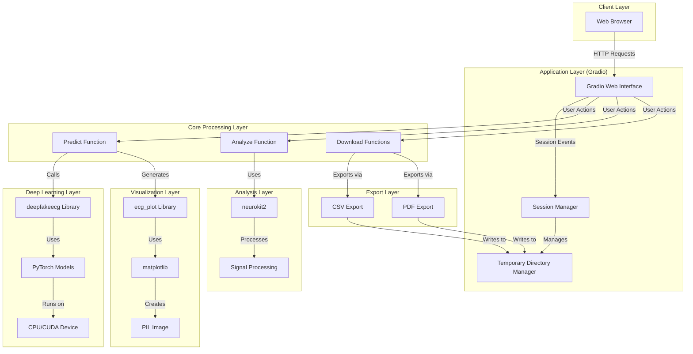
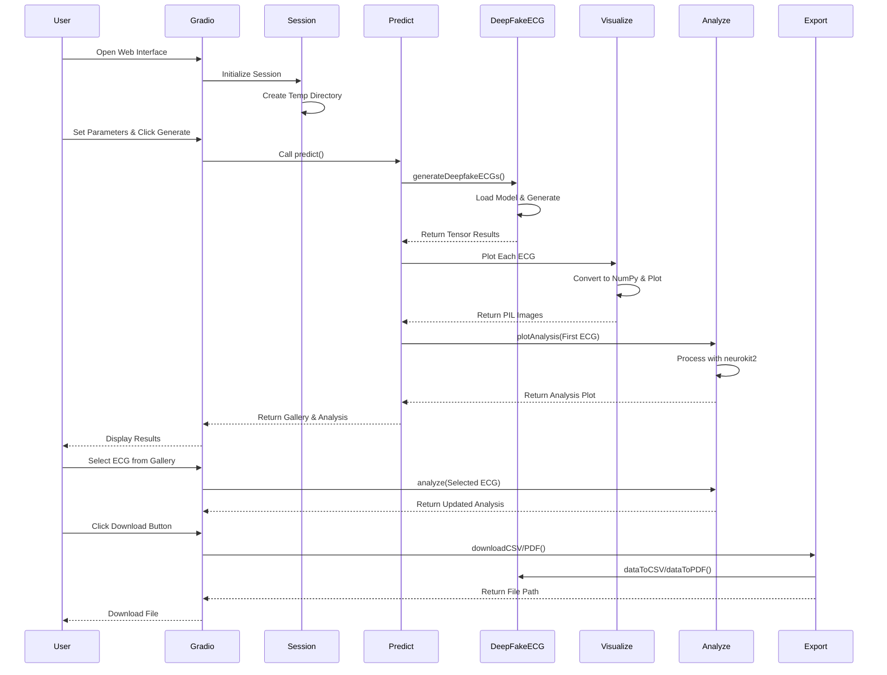

# Deepfake ECG Generator Plus - Comprehensive Project Analysis

## Table of Contents
1. [High-Level Overview](#high-level-overview)
2. [Architecture](#architecture)
3. [System Workflow](#system-workflow)
4. [Setup and Run Instructions](#setup-and-run-instructions)
5. [Domain-Specific Logic](#domain-specific-logic)
6. [Key Components](#key-components)

---

## High-Level Overview

### Project Purpose
**Deepfake ECG Generator Plus** is a web-based application that generates synthetic (deepfake) electrocardiogram (ECG) signals using deep learning models. The application provides a user-friendly Gradio-based GUI for generating, visualizing, analyzing, and exporting ECG data in multiple formats.

### Main Components
1. **Web GUI Application** (`app.py`) - Main application entry point with Gradio interface
2. **Deep Learning Engine** (`deepfakeecg` library) - Core ECG generation using PyTorch-based models
3. **Visualization System** - ECG plotting using `ecg_plot` and `matplotlib`
4. **Analysis Engine** - ECG signal analysis using `neurokit2`
5. **Export System** - CSV and PDF export functionality
6. **Session Management** - Multi-user session handling with temporary file management

### Key Features
- Generate multiple synthetic ECG signals (1-100 at a time)
- Support for two ECG types: **ECG-12** (12-lead) and **ECG-8** (8-lead)
- Real-time visualization of generated ECGs
- Automatic ECG signal analysis (heart rate, R-peaks, etc.)
- Export capabilities: CSV data, PDF reports (with/without analysis)
- GPU acceleration support (CUDA) with automatic CPU fallback
- Multi-user session support with isolated temporary directories

### Research Foundation
Based on the research paper: [Nature Scientific Reports - Deepfake ECG Generation](https://www.nature.com/articles/s41598-021-01295-2)

---

## Architecture

### System Architecture Diagram



### Module Interaction Flow



### File Structure

```
deepfake-ecg-generator-plus/
├── app.py                 # Main application file (Gradio GUI)
├── version.py             # Version information
├── requirements.txt       # Python dependencies
├── README.md             # Basic setup instructions
├── test.html             # HTML test file (UI reference)
├── test.css              # CSS stylesheet (UI reference)
├── check-with-mypy       # Type checking script
└── PROJECT_ANALYSIS.md   # This document
```

### Key Classes and Functions

#### Session Class
- **Purpose**: Manages user session state
- **Attributes**:
  - `Counter`: Session counter
  - `Selected`: Currently selected ECG index
  - `Results`: List of generated ECG tensors
  - `Analysis`: Matplotlib figure for analysis
  - `Type`: ECG type (ECG-12 or ECG-8)
  - `TempDirectory`: Temporary directory for file exports
- **Thread Safety**: Uses `threading.Lock()` for concurrent access

#### Main Functions

1. **`predict()`** - Core ECG generation function
   - Inputs: Number of ECGs, ECG type, generator model
   - Outputs: Gallery of ECG images, analysis plot
   - Process: Generates ECGs → Visualizes → Analyzes first ECG

2. **`plotAnalysis()`** - ECG signal analysis
   - Input: PyTorch tensor (ECG data)
   - Output: Matplotlib figure with analysis
   - Uses: neurokit2 for signal processing

3. **`download()`** - Generic download handler
   - Supports: CSV, PDF, PDF with analysis
   - Creates files in session's temporary directory

4. **`analyze()`** - Analyze selected ECG
   - Triggered when user selects ECG from gallery
   - Updates analysis plot

---

## System Workflow

### Complete Workflow: From Input to Output

#### Step 1: Application Initialization
1. **Parse Command-Line Arguments**
   - `-d/--device`: Specify device (cpu/cuda)
   - `-v/--version`: Display version information
   - Default: Auto-detect CUDA availability

2. **Initialize Global Resources**
   - Create global temporary directory (`TempDirectory`)
   - Initialize session dictionary (`Sessions`)
   - Set up matplotlib backend (`Agg` for non-interactive)

3. **Create Gradio Interface**
   - Configure CSS styling (Simula branding)
   - Set up theme (Glass theme with blue accent)
   - Define UI components:
     - Header with logos
     - Control panel (sliders, dropdowns, buttons)
     - Output gallery
     - Analysis plot area

#### Step 2: User Session Initialization
1. **Page Load Event**
   - `gui.load(initializeSession)` triggers
   - Creates new `Session` object
   - Assigns unique session hash
   - Creates session-specific temporary directory
   - Logs session creation

2. **Initial ECG Generation**
   - Automatically generates default ECGs on page load
   - Uses default parameters (4 ECGs, ECG-12 type)

#### Step 3: ECG Generation Process

**3.1 User Input**
- User adjusts parameters:
  - Number of ECGs (1-100)
  - ECG Type (ECG-12 or ECG-8)
  - Generator Model (currently only "Default")
- User clicks "Generate ECGs!" button

**3.2 Generation Pipeline**
```
User Input → predict() Function
    ↓
1. Validate ECG Type
   - Map string to deepfakeecg constant
   - Default to ECG-12 if invalid
    ↓
2. Configure Matplotlib
   - Set MAXTICKS for large datasets
   - Formula: max(1000, length × sampling_rate)
    ↓
3. Call Deep Learning Model
   - deepfakeecg.generateDeepfakeECGs()
   - Parameters:
     * numberOfECGs
     * ecgType (DATA_ECG12 or DATA_ECG8)
     * ecgLengthInSeconds (fixed at 10)
     * ecgScaleFactor (default)
     * outputFormat (OUTPUT_TENSOR)
     * runOnDevice (cpu/cuda)
    ↓
4. Model Processing (inside deepfakeecg library)
   - Load pre-trained PyTorch model
   - Generate random noise vectors
   - Forward pass through generator network
   - Output: List of PyTorch tensors
   - Each tensor: [channels × samples] format
     * Channel 0: Timestamp
     * Channels 1+: ECG leads (in µV)
    ↓
5. Store Results
   - Save tensors in session.Results
   - Store ECG type in session.Type
```

**3.3 Visualization Pipeline**
```
For each generated ECG:
    ↓
1. Data Conversion
   - Transpose tensor: .t()
   - Move to CPU: .detach().cpu()
   - Convert to NumPy: .numpy()
   - Remove timestamp column: [1:]
   - Convert µV to mV: / 1000
    ↓
2. ECG Plotting
   - Use ecg_plot.plot()
   - Parameters:
     * ECG data array
     * Sample rate (from deepfakeecg.ECG_SAMPLING_RATE)
     * Lead labels (I, II, III, aVR, aVL, aVF, V1-V6)
     * Lead order (specific arrangement)
     * Grid display
    ↓
3. Image Generation
   - Save plot to BytesIO buffer
   - Format: WebP
   - Convert to PIL Image
   - Add to gallery list with label
    ↓
4. Gallery Assembly
   - Create list of (image, label) tuples
   - Return to Gradio Gallery component
```

**3.4 Analysis Pipeline**
```
First ECG from Results:
    ↓
1. Extract Lead I
   - Use first lead (index 0) for analysis
   - Standard practice for heart rate analysis
    ↓
2. Signal Processing
   - neurokit2.ecg_process()
   - Detects:
     * R-peaks
     * Heart rate
     * Signal quality
     * Cardiac events
    ↓
3. Visualization
   - neurokit2.ecg_plot()
   - Creates analysis figure
   - Resize to standard dimensions (508×122 mm)
    ↓
4. Store Analysis
   - Save figure in session.Analysis
   - Display in analysis output area
```

#### Step 4: User Interaction

**4.1 ECG Selection**
- User clicks on ECG in gallery
- Triggers `analyze()` function
- Updates `session.Selected` index
- Re-runs analysis on selected ECG
- Updates analysis plot

**4.2 File Download**

**CSV Export:**
```
User clicks "Download CSV"
    ↓
downloadCSV() called
    ↓
download() with OUTPUT_CSV format
    ↓
deepfakeecg.dataToCSV()
    ↓
Creates CSV file in temp directory
    ↓
Returns file path to Gradio
    ↓
Browser downloads file
```

**PDF Export:**
```
User clicks "Download PDF" or "Download ECG+Analysis PDF"
    ↓
downloadPDF() or downloadPDFwithAnalysis() called
    ↓
download() with OUTPUT_PDF or OUTPUT_PDF_ANALYSIS
    ↓
deepfakeecg.dataToPDF()
    ↓
Creates PDF file in temp directory
    ↓
Returns file path to Gradio
    ↓
Browser downloads file
```

#### Step 5: Session Cleanup
1. **Page Unload Event**
   - `gui.unload(cleanUpSession)` triggers
   - Closes matplotlib figures
   - Removes session from dictionary
   - Temporary directory cleaned up automatically (Python's TemporaryDirectory)

2. **Application Shutdown**
   - Global temporary directory cleanup
   - All sessions terminated

---

## Setup and Run Instructions

### Prerequisites

#### System Requirements
- **Operating System**: Windows, Linux, or macOS
- **Python**: Version 3.8 or higher
- **RAM**: Minimum 4GB (8GB+ recommended)
- **GPU**: Optional but recommended (NVIDIA GPU with CUDA support)
- **Disk Space**: ~2GB for dependencies and models

#### Software Dependencies
- Python 3.8+
- pip (Python package manager)
- Git (for installing deepfakeecg from GitHub)
- CUDA Toolkit (optional, for GPU acceleration)

### Installation Steps

#### 1. Clone or Download the Project
```bash
# If using git
git clone <repository-url>
cd deepfake-ecg-generator-plus

# Or extract the downloaded archive
```

#### 2. Create Virtual Environment
```bash
# On Linux/macOS
mkdir -p ~/python-environments/deepfake-ecg
python3 -m venv ~/python-environments/deepfake-ecg
source ~/python-environments/deepfake-ecg/bin/activate

# On Windows
mkdir %USERPROFILE%\python-environments\deepfake-ecg
python -m venv %USERPROFILE%\python-environments\deepfake-ecg
%USERPROFILE%\python-environments\deepfake-ecg\Scripts\activate
```

#### 3. Install Dependencies
```bash
# Ensure pip is up to date
pip install --upgrade pip

# Install requirements
pip install -r requirements.txt
```

**Note**: The `requirements.txt` includes a Git dependency:
```
git+https://github.com/dreibh/deepfake-ecg@dreibh/clean-ups#egg=deepfake_ecg
```
This will automatically clone and install the deepfakeecg library from GitHub.

#### 4. Verify Installation
```bash
# Check Python version
python --version  # Should be 3.8+

# Check PyTorch and CUDA (if applicable)
python -c "import torch; print(f'PyTorch: {torch.__version__}'); print(f'CUDA available: {torch.cuda.is_available()}')"
```

### Running the Application

#### Local Development

**Method 1: Direct Execution**
```bash
# Make script executable (Linux/macOS)
chmod +x app.py

# Run the application
./app.py

# Or on Windows
python app.py
```

**Method 2: With Python Module**
```bash
python -m app
```

**Method 3: With Custom Device**
```bash
# Force CPU
python app.py --device cpu

# Force CUDA (if available)
python app.py --device cuda

# Check version info
python app.py --version
```

#### Accessing the Application
1. After starting, the application will display:
   ```
   Running on local URL:  http://127.0.0.1:7860
   ```
2. Open a web browser and navigate to: `http://127.0.0.1:7860`
3. The Gradio interface will load automatically

#### Production Deployment

**Option 1: Gradio Sharing (Quick)**
```python
# Modify app.py, change launch() to:
gui.launch(
    allowed_paths=[TempDirectory.name],
    debug=True,
    share=True  # Creates public Gradio link
)
```

**Option 2: Custom Server**
```python
# Modify app.py launch() call:
gui.launch(
    allowed_paths=[TempDirectory.name],
    debug=False,
    server_name="0.0.0.0",  # Listen on all interfaces
    server_port=7860,
    share=False
)
```

**Option 3: Docker (Recommended for Production)**
```dockerfile
# Create Dockerfile
FROM python:3.10-slim

WORKDIR /app

COPY requirements.txt .
RUN pip install --no-cache-dir -r requirements.txt

COPY . .

EXPOSE 7860

CMD ["python", "app.py"]
```

```bash
# Build and run
docker build -t deepfake-ecg-plus .
docker run -p 7860:7860 deepfake-ecg-plus
```

### Testing

#### Type Checking
```bash
# Run mypy type checking
./check-with-mypy

# Or manually
mypy --strict --ignore-missing-imports app.py
```

#### Manual Testing Checklist
- [ ] Application starts without errors
- [ ] Web interface loads correctly
- [ ] Can generate ECGs (try 1, 4, 10)
- [ ] Both ECG-12 and ECG-8 types work
- [ ] Gallery displays generated ECGs
- [ ] Analysis plot appears
- [ ] Can select different ECGs from gallery
- [ ] Analysis updates when selecting different ECG
- [ ] CSV download works
- [ ] PDF download works
- [ ] PDF with analysis download works
- [ ] Multiple sessions work (open in different browsers)

### Troubleshooting

#### Common Issues

**1. Import Errors**
```bash
# Solution: Reinstall dependencies
pip install --force-reinstall -r requirements.txt
```

**2. CUDA Not Available**
```bash
# Check CUDA installation
nvidia-smi  # Should show GPU info

# Install PyTorch with CUDA support
pip install torch --index-url https://download.pytorch.org/whl/cu118
```

**3. Port Already in Use**
```python
# Modify app.py launch() to use different port
gui.launch(server_port=7861)
```

**4. Memory Issues**
- Reduce number of ECGs generated at once
- Use CPU instead of GPU
- Close other applications

**5. DeepfakeECG Library Installation Fails**
```bash
# Install Git first, then retry
# On Ubuntu/Debian: sudo apt-get install git
# On Windows: Download from https://git-scm.com/
```

---

## Domain-Specific Logic

### ECG Signal Generation

#### ECG Types

**ECG-12 (12-Lead Electrocardiogram)**
- **Leads**: I, II, III, aVR, aVL, aVF, V1, V2, V3, V4, V5, V6
- **Standard Layout**: 
  - Limb leads: I, II, III, aVR, aVL, aVF
  - Precordial leads: V1-V6
- **Display Order**: [I, II, V1, V2, V3, V4, V5, V6, III, aVR, aVL, aVF]
- **Clinical Use**: Complete cardiac assessment, standard diagnostic tool

**ECG-8 (8-Lead Electrocardiogram)**
- **Leads**: I, II, V1, V2, V3, V4, V5, V6
- **Display Order**: [I, II, V1, V2, V3, V4, V5, V6]
- **Clinical Use**: Reduced lead set, common in monitoring scenarios

#### Signal Characteristics

**Sampling Rate**
- Defined by `deepfakeecg.ECG_SAMPLING_RATE`
- Typically 500 Hz (standard clinical rate)
- Determines temporal resolution

**Signal Units**
- **Internal Storage**: Microvolts (µV)
- **Display/Export**: Millivolts (mV)
- **Conversion**: Divide by 1000 (line 156 in app.py)

**Signal Length**
- Fixed at 10 seconds per ECG
- Total samples = 10 × sampling_rate
- Standard clinical strip length

**Scale Factor**
- Controlled by `deepfakeecg.ECG_DEFAULT_SCALE_FACTOR`
- Affects signal amplitude
- Ensures realistic voltage ranges

#### Deep Learning Model

**Architecture** (from deepfakeecg library)
- **Type**: Generative Adversarial Network (GAN) or Variational Autoencoder (VAE)
- **Input**: Random noise vector (latent space)
- **Output**: Multi-channel ECG signal tensor
- **Training**: Based on real ECG datasets
- **Reference**: Nature Scientific Reports paper

**Generation Process**
1. Sample random noise from latent distribution
2. Forward pass through generator network
3. Output raw signal tensor
4. Post-processing (scaling, normalization)
5. Format conversion for display/export

### ECG Analysis Logic

#### Signal Processing Pipeline

**1. Lead Selection**
- Analysis uses **Lead I** (first lead)
- Standard for heart rate detection
- Most stable and noise-resistant

**2. NeuroKit2 Processing**
```python
signals, info = neurokit2.ecg_process(leadI, sampling_rate)
```

**Processing Steps**:
- **Preprocessing**: Filtering, baseline correction
- **R-Peak Detection**: Identifies QRS complexes
- **Heart Rate Calculation**: Based on R-R intervals
- **Feature Extraction**: P-waves, T-waves, intervals
- **Quality Assessment**: Signal quality metrics

**3. Visualization**
- **Plot Type**: Standard ECG analysis plot
- **Components**:
  - Raw signal
  - Detected R-peaks (marked)
  - Heart rate information
  - Signal quality indicators
- **Dimensions**: 508×122 mm (standard strip size)

### Export Formats

#### CSV Format
- **Structure**: 
  - Column 0: Timestamp (seconds)
  - Columns 1+: ECG leads (in original units)
- **Use Case**: Data analysis, further processing
- **Generated by**: `deepfakeecg.dataToCSV()`

#### PDF Format

**Standard PDF** (`OUTPUT_PDF`):
- Multi-page document
- Each page: One ECG lead
- Standard clinical format
- Grid and annotations included

**PDF with Analysis** (`OUTPUT_PDF_ANALYSIS`):
- Includes all standard PDF content
- Additional page: Analysis results
- Heart rate, R-peak locations
- Signal quality metrics

**Lead Ordering**:
- ECG-12: [I, II, III, aVL, aVR, aVF, V1, V2, V3, V4, V5, V6]
- ECG-8: [I, II, V1, V2, V3, V4, V5, V6]

### Session Management

#### Session Lifecycle

**1. Creation**
- Triggered on page load
- Unique session hash (Gradio-generated)
- Isolated temporary directory
- Thread-safe initialization

**2. State Management**
- **Results**: List of generated ECG tensors
- **Selected**: Currently viewed ECG index
- **Analysis**: Matplotlib figure (memory management)
- **Type**: ECG type for export formatting

**3. Cleanup**
- Automatic on page unload
- Matplotlib figure closure (prevents memory leaks)
- Temporary directory cleanup (Python's context manager)
- Session removal from dictionary

#### Thread Safety
- `threading.Lock()` in Session class
- Prevents race conditions in multi-user scenarios
- Critical for concurrent access to session data

### UI/UX Logic

#### Display Standards

**ECG Plot Format**:
- **Paper Speed**: 25 mm/sec (standard clinical)
- **Amplitude**: 1 mV/10 mm (standard calibration)
- **Grid**: Enabled for measurement
- **Title**: Includes ECG type and calibration info

**Layout**:
- **Header**: Fixed height (10vh), Simula branding
- **Controls**: Horizontal row, responsive
- **Gallery**: 8 columns, auto-height
- **Analysis**: Full-width plot area

#### User Interactions

**Generate Button**:
- Triggers full generation pipeline
- Updates both gallery and analysis
- Non-blocking (Gradio handles async)

**Gallery Selection**:
- Click on ECG image
- Updates analysis for selected ECG
- Maintains selection state

**Download Buttons**:
- Hidden button technique (Gradio workaround)
- JavaScript trigger for file download
- Generates file on-demand
- Uses session's temporary directory

### Performance Considerations

#### GPU Acceleration
- **Automatic Detection**: Checks CUDA availability
- **Fallback**: Uses CPU if GPU unavailable
- **Device Selection**: Command-line override available
- **Impact**: Significant speedup for batch generation

#### Memory Management
- **Matplotlib Figures**: Explicitly closed after use
- **Temporary Files**: Automatic cleanup
- **Tensor Operations**: Moved to CPU after generation
- **Session Isolation**: Prevents memory leaks

#### Optimization Strategies
1. **Batch Generation**: Generate multiple ECGs in one call
2. **Lazy Loading**: Analysis only when needed
3. **Image Format**: WebP for efficient storage
4. **Figure Reuse**: Update existing figures when possible

---

## Key Components

### Dependencies Breakdown

#### Core Libraries
- **gradio** (5.48.0): Web interface framework
- **torch**: Deep learning framework (PyTorch)
- **deepfakeecg**: ECG generation library (GitHub)
- **neurokit2**: ECG signal processing
- **matplotlib**: Plotting and visualization
- **ecg-plot**: Specialized ECG plotting
- **Pillow (PIL)**: Image processing
- **pydantic** (2.10.6): Data validation
- **numpy**: Numerical operations

#### External Services
- **Background Images**: Loaded from external URLs (Simula/NorNet)
- **Model Weights**: Loaded by deepfakeecg library (likely from HuggingFace or similar)

### Configuration Constants

**From `version.py`**:
- `DEEPFAKEECGGENPLUS_VERSION`: "0.6.0~rc2"
- Version tracking for releases

**From `deepfakeecg` library**:
- `ECG_SAMPLING_RATE`: Sampling frequency (Hz)
- `ECG_DEFAULT_SCALE_FACTOR`: Amplitude scaling
- `DATA_ECG12`, `DATA_ECG8`: ECG type constants
- `OUTPUT_TENSOR`, `OUTPUT_CSV`, `OUTPUT_PDF`, `OUTPUT_PDF_ANALYSIS`: Format constants

### Code Quality

#### Type Hints
- Extensive use of Python type hints
- Enables static type checking with mypy
- Improves code maintainability

#### Error Handling
- Command-line argument validation
- ECG type validation with fallback
- Session existence checks
- File operation error handling

#### Logging
- Custom `log()` function with timestamps
- Color-coded output (blue)
- Session tracking
- Operation logging

---

## Additional Notes

### Research Context
This application implements the methodology described in:
- **Paper**: "Deepfake electrocardiograms using generative adversarial networks"
- **Journal**: Nature Scientific Reports
- **DOI**: Available via the provided link
- **Purpose**: Generate synthetic ECG data for research, training, and privacy-preserving applications

### Ethical Considerations
- **Medical Disclaimer**: Generated ECGs are synthetic and should not be used for actual medical diagnosis
- **Research Use**: Intended for research, education, and development purposes
- **Privacy**: Synthetic data generation helps protect patient privacy in research

### Future Enhancements
Potential improvements (not currently implemented):
- Custom ECG length selection
- Additional generator models
- Real-time generation preview
- Batch export functionality
- Advanced analysis options
- Model fine-tuning interface

### License
- **Application**: GNU General Public License v3.0
- **README Metadata**: Creative Commons Attribution 4.0 (CC-BY-4.0)

---

## Quick Reference

### Key Commands
```bash
# Setup
python -m venv venv
source venv/bin/activate  # or: venv\Scripts\activate on Windows
pip install -r requirements.txt

# Run
python app.py

# Type Check
mypy --strict --ignore-missing-imports app.py

# Version Info
python app.py --version
```

### Key URLs
- **Local Access**: http://127.0.0.1:7860
- **Research Paper**: https://www.nature.com/articles/s41598-021-01295-2
- **DeepfakeECG Library**: https://github.com/dreibh/deepfake-ecg

### Key Functions
- `predict()`: Generate ECGs
- `plotAnalysis()`: Analyze ECG signal
- `download()`: Export files
- `analyze()`: Update analysis for selected ECG

---

**Document Version**: 1.0  
**Last Updated**: Based on codebase analysis  
**Maintained By**: Project Contributors

